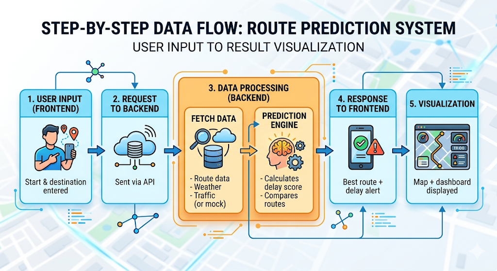

# LogiPredict AI
# AI-Powered Predictive Logistics Disruption & Route Optimization System.

#### Overview:
DelayGuard AI is a smart logistics system that predicts delivery delays before they happen and suggests optimized routes in real-time.

Unlike traditional tracking systems, this project focuses on proactive decision-making instead of reactive monitoring.

### Problem Statement:
Current logistics systems react to delays after they occur. There is no widely accessible system that can predict disruptions in advance and suggest corrective actions.

This leads to:
- Increased fuel consumption
- Delivery inefficiencies
- Customer dissatisfaction

### Solution:
DelayGuard AI uses intelligent logic to:
- Predict delay probability.
- Analyze route conditions.
- Suggest optimal routes.

#### Key Features:
1.Route Input (Start → Destination)

2.Delay Prediction Engine

3.Smart Route Suggestion

4.Visual Dashboard

5.Map Integration (Leaflet)

### Tech Stack
Frontend:
HTML, CSS, JavaScript

Backend:
Python (Flask)

Database:
MongoDB / Firebase

APIs:
OpenStreetMap (Leaflet)
OpenWeather API

### System Architecture:
Our system integrates frontend interaction, backend intelligence, and external data sources to deliver real-time predictive logistics optimization.

## Sustainability Impact:

This project supports:

 1.SDG 9 – Industry, Innovation & Infrastructure
 
 2.SDG 11 – Sustainable Cities
 
 3.SDG 12 – Responsible Consumption
 
 4.SDG 13 – Climate Action

 ### Demo:

 ### Team:

 ### Future Scope:
Real-time traffic integration
Machine learning model
Mobile application

## Key Insight:

“We don’t track delays — we prevent them.”
